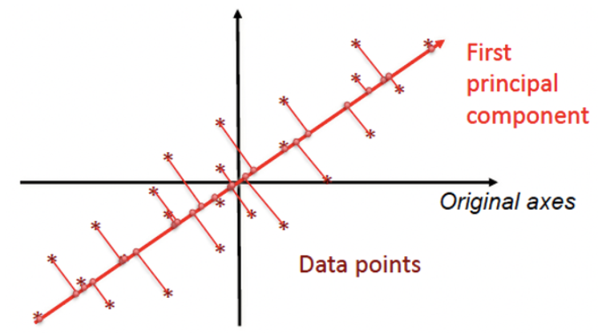
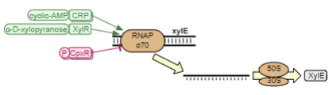
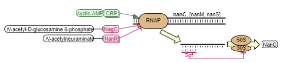
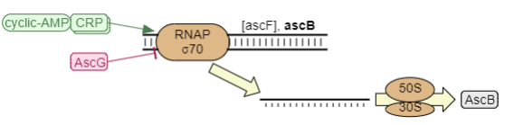
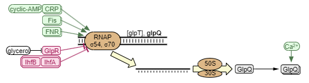
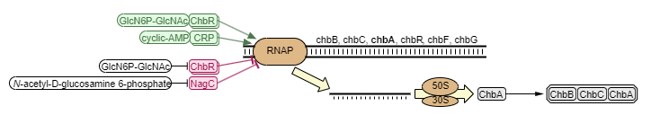

# Introduction

***Escherichia coli*** is a gram negative bacterium and it is the most studied bacterial model organism for many reasons like its ability to grow fast on cheap media and the fact that it can be genetically manipulated and modified much easier with respect to eukaryotic organisms like yeast or animals or even other bacteria. When an organism is as studied as *E. coli* the amount of data available about it can be massive, for this reason we would like to perform a bioinformatic analysis to extract knowledge from on one of the many RNA-seq dataset available for *E. coli*.

This project aims to establish a **proxy** for determining the activity of transcription factors based on the expression levels of the genes regulated by those factors. In prokaryotes genes with related functions are encoded together within the same genome block, which is called **operon**, and they are usually transcribed together in a, so called, **polycistronic transcript** because they are under the control of the same promoter.

The null hypothesis posits that the *abundance of transcripts serves as a reliable proxy for activity of the regulator*. However, this assumption may not hold for all transcription factors: some factors are active only when phosphorylated, meaning that their transcripts may be constitutively expressed while their activity depends on phosphorylation, correlating instead with the activity of the corresponding kinase.

We will also focus on developing a general model to relate transcription factor activity to transcript abundance. Significant deviations from this model could indicate transcription factors whose activity is not accurately reflected by transcript levels. One challenge of this approach is the fact that genes of the same operon may be highly *co-expressed* together which is a problem for many models like **linear regression**, so we will try to address it during our analysis.

### Table of Contents

Here are the steps that we performed in our analysis

1.  [Introduction]

2.  [Library loading]

3.  [Pre-processing]

4.  [Exploratory Analysis]

5.  [Modelling] -[cAMP Receptor Protein (crp)](#camp-receptor-protein-crp)

# Library loading

```{r message=FALSE, warning=FALSE}
library(readr)
library(matrixStats)
library(dplyr)
library(ggplot2)
library(grid)
library(gridExtra)
library(caret)
library(pls)
library(glmnet)
library(igraph)
library(vip)
library(rattle)
library(randomForestExplainer) 
library(clusterProfiler)
library(org.EcK12.eg.db)
```

# Pre-processing

Let's start importing the dataset from [PreciseDB](https://www.ncbi.nlm.nih.gov/pmc/articles/PMC540045/) which is an RNA-seq compendium for *Escherichia coli* from the Systems Biology Research group at UC San Diego which contains the expression levels for 3,923 genes in E. coli for 278 different condition. The approach they used was culturing bacteria on many different media and they measured gene expression values then they proceeded to knock-out many different genes and cultured again on the same media to measure expression again because they were expecting variations of expression; for example, they knocked out a gene for iron metabolism on a medium containing iron and this for sure affects the expression levels of the *E.coli* culture because the organism is not able to manage iron correctly anymore.

```{r}
# Import file 
log_tpm <- read.csv("log_tpm_full.csv", row.names = 1)
log_tpm
```

Next we want to perform some pre-processing. First we want to exclude:

-   Condition with knock-out genes

-   Genes with isoforms

For the nature of our analysis we are not interested in the conditions in which a gene is knocked-out because the influence of the knock-out gene may be huge on its related pathways, for this reason we excluded them because we want unbiased results. Researchers of PreciseDB also collected expression data about many gene isoforms, the problem is that the collection of isoforms was not complete and there was not a reliable way to decide which isoform to consider: considering all of them during the preprocessing would have resulted in having unmappable bnumbers and duplicate genes so we removed them from the dataset before proceeding.

```{r}
# Exclude condition with knockout genes
log_tpm <- log_tpm[, -grep("_del", colnames(log_tpm))]

# Drop genes with isoform
genes_with_isoforms <- grep("_\\d+$", rownames(log_tpm), value = TRUE)

log_tpm <- subset(log_tpm, !(rownames(log_tpm) %in% genes_with_isoforms))
dim(log_tpm)
```

Now we can proceed to import the regulatory network from [RegulonDB](https://regulondb.ccg.unam.mx/) that reports the target genes for each regulator. Each row of this dataset represents an edge in a regulatory network graph and contains informations about the interaction of which one of the most important one is probably if the interaction is positive or negative.

```{r}
regulator <- read.table(file="tableDataReg.csv",
                        header=TRUE, 
                        sep=",")
regulator
```

We decided to eliminate:

-   Entries that are not referred to a protein regulator.

-   Relationships reported as *Weak* or *Unknown* to work only on meaningful interactions.

```{r}
regulator <- regulator[which(regulator[, 2] != "ppGpp"), ]

w <- which(trimws(regulator[,7])=="W")
if(length(w)>0){
  regulator <- regulator[-w,]
}

w <- which(trimws(regulator[,7])=="?")
if(length(w)>0){
  regulator <- regulator[-w,]
}

nrow(regulator)
```

There is a discrepancy between the gene identifiers present in the regulatory network obtained from RegulonDB and those in the PreciseDB dataset. While the regulatory network uses gene names, our dataset contained identifiers in the form of bnumbers. So it's better to convert bnumbers to gene names to facilitate comparison and downstream analysis. In addition we decided to:

-   Remove entries with bnumbers that don't map with a gene name

-   Remove duplicate genes

```{r}
# Loading the file from ECOcyc which contain the mapping bnum-genename
map_bnum <- read.delim("mapbnum.txt", header = TRUE)

# Keep only the useful columns
map_bnum <- map_bnum[c("Gene.Name", "Accession.1")]

# Map between our dataset and the file of ecocyc
log_tpm$gene_number <- rownames(log_tpm)
log_tpm <- merge(log_tpm, map_bnum, by.x = "gene_number", by.y = "Accession.1", all.x = TRUE)

# Rearrange the dataset
log_tpm <- log_tpm[, c("Gene.Name", setdiff(names(log_tpm), "Gene.Name"))]

# Removing unmapped genes bnumber
log_tpm <- subset(log_tpm, !is.na(Gene.Name))

# Removing duplicate genes (it also has all expression values equal 0 so very bad)
log_tpm <- subset(log_tpm, !(log_tpm$Gene.Name == "insI2"))

# Setting rownames and dropping the first 2 columns
rownames(log_tpm) <- log_tpm$Gene.Name
log_tpm <- log_tpm[,3:ncol(log_tpm)]

# Transpose log_tpm in order to have genes as columns and conditions as rows
log_tpm <- t(log_tpm)
```

# Exploratory Analysis

We would like to verify if we can use one the four major summary statistics which are **mean**, **median**, **maximum** and **minimum** of expression of each gene to model the *relationship between the targets and their regulator*. Now let's analyze the distribution of these statistics to understand which is the best value to choose, if any, then we also want check if they follow a **Gaussian distribution** using the Shapiro--Wilk test which computes the W statistics as follows:

$$
\large W = \dfrac{\big(\sum^n _ {i=1} a_i x_{(i)} \big ) ^2}{\sum^n _ {i=1} (x_i - \bar{x})^2}
$$

Then this W value is used for the hypothesis testing that follows:

$$
 \large H_o: \text{a sample } x_1, \cdots, x_n \text{ is drawn from a normally distributed population.} \\
\large H_a: \text{a sample } x_1, \cdots, x_n \text{ is not drawn from a normally distributed population.}
$$

If the test returns a *p-value* lower then the threshold 0.05 it means that the data **do not** follow a normal distribution.

```{r, fig.width = 12, fig.height = 12}
# Histograms of Summary Statistics

# MEAN
log_tpm_mean <- data.frame(value = apply(log_tpm, 2, mean))
mean_hist <- ggplot(log_tpm_mean, aes(x = value)) +
                    geom_histogram(binwidth = 0.5, fill = "skyblue", 
                                   color = "black", bins = 100) +
                    labs(x = "Mean log-TPM", y = "Frequency") +
                    theme_minimal() +
                    theme(panel.grid.major = element_blank(), 
                          panel.grid.minor = element_blank())

# MEDIAN
log_tpm_median <- data.frame(value = apply(log_tpm, 2, median))
median_hist <- ggplot(log_tpm_median, aes(x = value)) +
                      geom_histogram(binwidth = 0.5, fill = "lightgreen", 
                                     color = "black", bins = 100) +
                      labs(x = "Median log-TPM", y = "Frequency") +
                      theme_minimal() +
                      theme(panel.grid.major = element_blank(), 
                            panel.grid.minor = element_blank())

# MAX
log_tpm_max <- data.frame(value = apply(log_tpm, 2, max))
max_hist <- ggplot(log_tpm_max, aes(x = value)) +
                   geom_histogram(binwidth = 0.5, fill = "lavender", 
                                  color = "black", bins = 100) +
                   labs(x = "Max log-TPM", y = "Frequency") +
                   theme_minimal() +
                   theme(panel.grid.major = element_blank(), 
                         panel.grid.minor = element_blank())

# MIN
log_tpm_min <- data.frame(value = apply(log_tpm, 2, min))
min_hist <- ggplot(log_tpm_min, aes(x = value)) +
                   geom_histogram(binwidth = 0.5, fill = "lightpink", 
                                  color = "black", bins = 100) +
                   labs(x = "Min log-TPM", y = "Frequency") +
                   theme_minimal() +
                   theme(panel.grid.major = element_blank(), 
                         panel.grid.minor = element_blank())

# Final Plot
grid.arrange(mean_hist, median_hist, max_hist, min_hist, nrow = 2, ncol = 2,
             top = textGrob("Histograms of Summary Statistics", 
                            gp=gpar(fontsize=16)))
```

```{r}
#MEAN
shapiro.test(log_tpm_mean$value) #not gaussian

#MEDIAN
shapiro.test(log_tpm_median$value) #not gaussian

#MAXIMUM
shapiro.test(log_tpm_max$value) #not gaussian

#MINIMUM
shapiro.test(log_tpm_min$value) #not gaussian
```

Based on the results of the Shapiro-Wilk tests conducted on the four distributions and their respective histograms, we can conclude that the distributions do not follow to a Gaussian (normal) distribution.\

There's a potential issue with using statistics like mean, median, maximum, or minimum as predictors in our linear regression model. These statistics might not align with the model's assumption that the data follows a normal (bell-shaped) distribution. Additionally, using just one of these statistics for each condition would essentially be training the model on a single data point per condition, which wouldn't be statistically sound.\
To address this, in the next section on modeling, we'll explore using the average (mean) of all target values within each condition. This approach provides us with multiple data points per condition (one average value for each condition) and avoids relying on single data points like minimum or maximum.

Now we plot some histograms to have a better idea on the number of positive, negative and total interactions of each regulator:

```{r, fig.width = 12, fig.height = 9}
# Divide positive and negative regulation
positive_reg <- regulator[regulator$X6.function == "+",]
negative_reg <- regulator[regulator$X6.function == "-",]

# Identify the different regulators in the dataset
unique_regulators <- unique(regulator$X3.RegulatorGeneName)

pos_counts <- c()
neg_counts <- c()

# Count how many genes are regulated by each regulator
for(reg in unique_regulators){
  pos_counts <- c(pos_counts, 
                  count(positive_reg[positive_reg$X3.RegulatorGeneName == reg,]))
  neg_counts <- c(neg_counts, 
                  count(negative_reg[negative_reg$X3.RegulatorGeneName == reg,]))
}

pos_counts <- unlist(pos_counts)
names(pos_counts) <- unique_regulators

neg_counts <- unlist(neg_counts)
names(neg_counts) <- unique_regulators

pos_counts <- data.frame(value = pos_counts)
neg_counts <- data.frame(value = neg_counts)
total_counts <- data.frame(value = pos_counts$value + neg_counts$value)

# Histograms of how many genes are regulated by each gene

# Positive Counts Histogram
pos_counts_hist <- ggplot(pos_counts, aes(x = value)) +
                          geom_histogram(binwidth = 10, fill = "skyblue", 
                                         color = "black", bins = 20) +
                          labs(x = "Positive Regulations Count", y = "Frequency") +
                          theme_minimal() +
                          theme(panel.grid.major = element_blank(), 
                                panel.grid.minor = element_blank())

# Negative Counts Histogram
neg_counts_hist <- ggplot(neg_counts, aes(x = value)) +
                          geom_histogram(binwidth = 10, fill = "lightgreen", 
                                         color = "black", bins = 20) +
                          labs(x = "Negative Regulations Count", y = "Frequency") +
                          theme_minimal() +
                          theme(panel.grid.major = element_blank(), 
                                panel.grid.minor = element_blank())

# Total Counts Histogram
total_counts_hist <- ggplot(total_counts, aes(x = value)) +
                            geom_histogram(binwidth = 10, fill = "lightpink", 
                                           color = "black", bins = 20) +
                            labs(x = "Total Regulations Count", y = "Frequency") +
                            theme_minimal() +
                            theme(panel.grid.major = element_blank(), 
                                  panel.grid.minor = element_blank())

# Final Plot
grid.arrange(pos_counts_hist, neg_counts_hist, total_counts_hist, ncol = 1)
```

These histograms show how many genes are regulated by how many regulator. The horizontal axis indicates how many genes are controlled by the regulator and the vertical axis indicates how many regulators have that number of interactions; for example there are more than 150 regulators that positively interact with 0 genes .This is not surprising because we removed weak and unknown interactions and we can also see that there is a gene that negatively controls a number of genes close to 400. There are slightly more negative regulators that interact with at least one gene then positive. In addition we observe that majority of genes does not interact with other genes but there are some exceptions like the gene **crp** which positively interacts with 310 other genes.

### Network analysis

Let's

```{r, fig.width = 12, fig.height = 12}
# Creating adj matrix to plot the network
edge_list <- cbind(RegulatorName = regulator$X3.RegulatorGeneName, 
                   Target = regulator$X5.regulatedName)
graph <- graph_from_edgelist(edge_list)
layout <- layout_with_fr(graph, niter=100)

plot.igraph(graph, layout=layout, vertex.label=NA, vertex.size=3, edge.arrow.size=0.2, edge.curved=TRUE, main="E.coli Network", xlim=c(-0.5, 0.5), ylim=c(-1, 1))

```

**Centrality Measures:**

-   **Degree:** This indicates the number of connections a gene (node) has within the network. Nodes with high degree are considered hubs and might play a key role in gene regulation.

-   **Betweenness Centrality:** This quantifies the information flow that passes through a node. Nodes with high betweenness centrality act as bridges between gene groups and might be crucial for coordinating gene expression.

-   **Closeness Centrality:** It measures how close a node is, on average, to all other nodes in the network. Nodes with high closeness centrality are positioned centrally and could facilitate communication between different network parts.

So in the next steps we are going to find the top 25 genes for centrality score. Then to have a better idea we are going to perform enrichment analysis over the top 25 gene set for each measure.

```{r}
# Centrality metrics
degree_scores <- degree(graph)
betweenness_scores <- betweenness(graph)
closeness_scores <- closeness(graph)
```

```{r}
# Function to get the top 25 genes for a given measure
get_top_genes <- function(scores) {
  sorted_scores <- sort(scores, decreasing = TRUE)
  top_genes <- head(names(sorted_scores), 25)
  top_scores <- head(sorted_scores, 25)
  data.frame(Gene = top_genes, Score = top_scores)
}
```

```{r}
# Get top 10 genes for each measure
top_degree <- get_top_genes(degree_scores)
print(top_degree)
```

Let's analyze the result via GO enrichment analysis:

```{r, fig.width = 12, fig.height = 6}
enrich_results_deg <- enrichGO(top_degree$Gene, keyType = "SYMBOL", OrgDb = "org.EcK12.eg.db")
dotplot(enrich_results_deg, showCategory=20)
```

The results suggest that the top 25 genes with the highest degree centrality act as hubs in the regulatory network. These genes are key players in controlling the expression of many other genes, consistent with their roles as transcription factors and DNA-binding proteins.

Now let's analyze the results for betweenness that measures the extent to which a node lies on the shortest paths between other nodes in the network. It indicates how often a node acts as a bridge along the shortest path between two other nodes.

```{r}
top_betweenness <- get_top_genes(betweenness_scores)
print(top_betweenness)
```

As before, we perform enrichment analysis and plot the results:

```{r, fig.width = 12, fig.height = 6}
enrich_results_bet <- enrichGO(top_betweenness$Gene, keyType = "SYMBOL", OrgDb = "org.EcK12.eg.db")
dotplot(enrich_results_bet, showCategory=20)
```

High betweenness centrality genes are expected to be pivotal in regulating key processes and facilitating communication within the network. The identified GO terms are consistent with roles in transcriptional regulation, signal transduction, genome maintenance, and cellular response mechanisms. These genes serve as crucial nodes that bridge different parts of the network, controlling the flow of genetic information and ensuring coordinated cellular functions.

Let's repeat the process for the last measure of centrality. Closeness measures how quickly a node can reach all other nodes in the network, suggesting that these genes are well-positioned to influence the entire network efficiently.

```{r}
top_closeness <- get_top_genes(closeness_scores)
print(top_closeness)
```

For the last time we perform enrichment analysis and plot the results:

```{r, fig.width = 12, fig.height = 6}
enrich_results_close <- enrichGO(top_closeness$Gene, keyType = "SYMBOL", OrgDb = "org.EcK12.eg.db")
dotplot(enrich_results_close, showCategory=20)
```

The GO terms enriched among the top closeness centrality genes highlight their crucial roles in RNA binding and processing, transcription regulation, and maintaining structural integrity. These genes are well-positioned to influence the network efficiently, ensuring rapid coordination and regulation of essential cellular processes. Their involvement in key functions like protein synthesis, transcription regulation, and structural maintenance underscores their importance in the overall regulatory and functional landscape of the cell.

# Modelling

In order to find a mathematical model able to describe the complexity of this biological problem we would like to start with a specific case and look for what might be the best approach for it. Then we will apply this approach to each regulator.\
We chose the gene **crp** because it is the positive regulator with the most targets, therefore it can be interesting to use it as a test case.\
After choosing the best approach, we will apply it to all the other regulators.

## cAMP Receptor Protein (crp) {#camp-receptor-protein-crp}

The protein CRP is a **global transcription regulator**, which plays a major role in carbon catabolite repression (CCR) as well as other processes, because it can act as an activator, repressor, coactivator or corepressor.\
CRP binds cyclic AMP (cAMP) which allosterically activates it, this means that its activity should not be influenced by the activity of any kinase. Then it binds to its DNA binding site to directly regulate the transcription of about 300 genes in about 200 operons and indirectly regulate the expression of about half the genome.

### Simple Linear Regression

The first thing we want to try, as anticipated in the previous section, is taking the mean of all the targets in every condition and fit a linear regression model with only this one feature. Let's start to take the data about crp expression and the expression of its targets

```{r}
# Expression of crp
crp_exp <- log_tpm[,colnames(log_tpm) == "crp"]

# List of positively regulated targets by crp
crp_target <- positive_reg[positive_reg$X3.RegulatorGeneName == "crp",]

# Expression of the targets
crp_target_exp <- log_tpm[,colnames(log_tpm) %in% crp_target$X5.regulatedName]
```

Now we take the simple mean of all the genes of each condition, in this way we will obtain as many means as the number of samples (188) and we fit a linear regression model using this mean as the sole feature. Then we put together a dataframe with all the data needed.

```{r}
# Apply the mean to each row of the dataset (mean of each condition)
crp_target_mean_conditions <- apply(crp_target_exp, 1, mean)

# Creating the training dataframe
crp_mean_train <- data.frame(crp = unlist(crp_exp), 
                             targets = unlist(crp_target_mean_conditions))
```

All the models that we will fit in this project will be validated with **10-fold cross-validation**.\
Cross-validation is a simple and widely used sampling technique for estimating prediction error to assess how the model would act against unseen data. It is often done when there is not enough data to set aside a validation set.\
It has many advantages like preventing over-fitting by providing a more robust estimate of the model's performances; it also allows model selection and hyperparameter tuning while being at the same time data efficient, because all the data is used for training and testing the model.

In the case of linear regression the purpose of cross-validation is only to get a robust estimate of the performances. In the next sections we will try to use it for model selection and hyperparameter tuning.

The rationale of 10-fold cross-validation is very simple because it divides the dataset in 10 folds then it uses 9 for training and the last one for testing. This procedure is repeated other 9 times by changing the testing fold and by using the remaining ones for training.


As you can see from the picture above at every iteration the procedure computes an error metric and at the end it will take the average of all the metrics to gave us a more robust estimate of real testing error.

The **caret package** is the R equivalent of Python scikit-learn and it allows to very easily set up the training of Machine Learning models and it also provide a very nice way to set-up a cross-validation in order to have more reliable models!

```{r}
## 10-fold CV
fit_control <- trainControl(
  method = "repeatedcv",
  number = 10,
  ## repeated ten times
  repeats = 10)
```

Let's get back to linear regression. Using one feature we are in the setting of **simple linear regression** which is a model that assumes that there is a linear relationship between $X$ and $Y$. In this case $Y$ is the expression of our regulator crp and $X$ is the mean of all its targets. The relationship between $X$ and $Y$ is modeled as follows:

$$\large Y \approx \beta_0 + \beta_1 X$$

To find a solution for this problem the **Least Squares Method** is employed: we know that $\hat{y_i} = \hat{\beta_0} + \hat{\beta_1}x_i$ is a prediction from our model and $e_i = y_i - \hat{y_i}$ is the residual error, that is the difference between the actual value $y_i$ and the predicted one $\hat{y_i}$.\
Least squares finds a solution that minimizes the residual sum of squares of all training data, RSS.

$$
\large RSS = e_1^2 + e_2^2 + \dots + e_N^2 = \sum_i (y_i - \hat{y_i})^2 = \sum_{i=1}^N (y_i - \hat{\beta_0} - \hat{\beta_1}x_i)^2
$$

Now we compute the partial derivatives of RSS with respect to the model parameters $\hat{\beta_0}$ and $\hat{\beta_1}$ and equate them to 0. The RSS function is **globally convex**, meaning that there exist a single stationary point which is a minimum for this reason we don't need to compute the second derivative to find the global minumun and we can directly solve the equations obtained before with respect to the parameters in this way:

$$\large \hat{\beta}_{1}=\frac{\sum_{i=1}^{n}\left(x_{i}-\overline{x}\right)\left(y_{i}-\overline{y}\right)}{\sum_{i=1}^{n}\left(x_{i}-\overline{x}\right)^{2}} \quad\quad$$ $$\large \hat{\beta}_{0}=\overline{y}-\hat{\beta}_{1} \overline{x}$$

where $\bar{x}$ is the mean of the means of expression of crp targets in all the conditions and $\bar{y}$ is the mean expression of crp.

As anticipated before, the fitting of linear regression with 10-fold cross-validation with caret can be achieved in a very simple way and with few lines of code

```{r}
#cv is a random procedure so we set a random seed for reproducibility
set.seed(123)

crp_lm_mean <- train(crp ~ targets, 
                     data = crp_mean_train,
                     method = "lm",
                     trControl = fit_control)
crp_lm_mean
```

The coefficient of determination, or $R^2$, is a measure that provides information about the goodness of fit of a model. In other word it is a value that tells us about the variance of the data explained by the model.\
It is computed using the following formula:

$$
\large R^2 = \dfrac{\sum^{n} _ {i = 1} \big(\hat{y_i} -\bar{y} \big)^2}{\sum^n _ {i = 1} (y_i -\bar{y})^2}
$$

$R^2$ values close to 1 tell us that the model is able to explain almost 100% of the variance of the data indicating that the model fitted very well the data and values close to 0 tell the opposite. In this case we got an $R^2$ = 0.03536782 which is a very low value; this means that the regression was not able to model the expression of the gene crp using the mean of its target. This result can be further explained by looking if some assumption of linear regression was not matched, more in detail we will now look for homoschedasticity and normality of the residuals.

```{r, fig.width = 12, fig.height = 5}
# scatterplot of the data with the regression line
crp_lm_mean_scatterplot <- ggplot(crp_mean_train, aes(x = targets, y = crp)) +
                           ggtitle("Scatterplot of targets mean and crp") +
                           theme(plot.title = element_text(hjust = 0.5)) + 
                           xlab("Targets Mean in each Condition") + 
                           ylab("crp expression in log(TPM)") + 
                           geom_point(size = 2) + 
                           geom_abline(intercept = crp_lm_mean$finalModel$coefficients[[1]],
                                       slope = crp_lm_mean$finalModel$coefficients[[2]],
                                       color = "red",
                                       linewidth = 1)  

# Dataframe containing fitted values and the residuals
crp_res <- data.frame(fitted.values = crp_lm_mean$finalModel$fitted.values,
                      residuals = crp_lm_mean$finalModel$residuals)

# Residuals scatterplot
crp_lm_mean_residuals <-  ggplot(crp_res, aes(x = fitted.values, y = residuals)) +
                          ggtitle("Residuals plot") +
                          theme(plot.title = element_text(hjust = 0.5)) + 
                          xlab("Fitted Values") +
                          ylab("Residuals") + 
                          geom_point() +
                          geom_hline(yintercept = 0, color = "red")

# Final plot
grid.arrange(crp_lm_mean_scatterplot, crp_lm_mean_residuals, nrow = 1)
```

On the left you can see the scatterplot of the targets mean in each condition as the independent variable and the value of expression of crp in $log(TPM)$ as the dependent variable with the regression line predicted by the model above drawn.\
On the right you can see the scatterplots of the residuals and we can notice just by looking that one assumption of linear regression is not matched: the variance of the residuals is not constant which means that the **homeschedasticity of the residuals** assumption is not met.

Now let's look for the normality of the residuals.

```{r, fig.width = 12, fig.height = 5}
crp_lm_mean_qq <- ggplot(crp_res, aes(sample=residuals)) +
                  ggtitle("Residuals QQ-plot") +
                  theme(plot.title = element_text(hjust = 0.5)) +
                  xlab("Theoretical Quantile") +
                  ylab("Residuals Quantiles") + 
                  stat_qq() + 
                  stat_qq_line(color = "red")
crp_lm_mean_qq
```

```{r}
shapiro.test(crp_res$residuals)
```

By looking at the QQ-plot we can see that the majority of the points are on the line, but they are skewed at the tails. Considering a p-value threshold of 0.05 for the normality test we can confidently say that the residuals are **not normally distributed**: so another important assumption of linear regression is not matched. Considering all the elements discussed before we conclude that this simple model is not able to describe the complex relationship between a regulator and its targets.

### Multivariate Linear Regression

Since only one variable was not enough to explain the relationship between the regulator and its targets we will now try to extend linear regression in order to include more variables in the model.\
Similarly to simple linear regression, we want to find the values for the model's parameters that minimize the residual sum of squares.

The mathematical formulation of a multivariate linear regression is the following:

$$ \large\hat{y}=\hat{\beta}_{0}+\hat{\beta}_{1} x_{1}+\hat{\beta}_{2} 
x_{2}+\cdots+\hat{\beta}_{p} x_{p}$$

The least squares solution for this problem involves matrix multiplication and the use of the, so called, **pseudo-inverse** to compute the ${\hat\beta}$ coefficients then it uses them to compute the model's predictions $\hat{y}$ by multiplying the vector of coefficients $\hat{\beta}$ with the matrix of the predictors $X$.

$$ \large\hat{\beta}=\left(\mathbf{X}^{T} \mathbf{X}\right)^{-1} \mathbf{X}^{T} \mathbf{y} \quad\quad \text{ where } X \text{ is a matrix } N \times (p+1) \text{ and } y \text{ is a } N \times 1 \text{ vector}$$

$$\large\hat{\mathbf{y}}=\mathbf{X} \hat{\beta}=\mathbf{X}\left(\mathbf{X}^{T} \mathbf{X}\right)^{-1} \mathbf{X}^{T} \mathbf{y} \quad\quad \text{ where } \hat{y} \text{ is the predicted value for each sample}$$

The first step is creating a dataframe containing the expression of crp and of all its targets.

```{r}
crp_exp <- data.frame(crp = crp_exp)
crp_full <- data.frame(cbind(crp_exp, crp_target_exp))
```

Then we train a model using all the target genes as predictors for crp expression with no further pre-processing and we cross-validate it.

```{r, warning = FALSE}
set.seed(123)
crp_lm <- train(crp ~., 
                data = crp_full,
                method = "lm",
                trControl = fit_control)
crp_lm
```

As you can see the $R^2$ of this model is still not satisfying at all and the RMSE is also very high. The Root Mean Square Error (RMSE) is a metric that describes the average distance between the predicted values and the real values:

$$
\large RMSE = \sqrt{\dfrac{\sum^{n} _ {i = 1} \big(\hat{y_i} -\bar{y} \big)^2}{n - p}}
$$

which means that a value of RMSE = 9.858278 is very high in the context of gene expression because we are working in logarithmic scale. In addition we would like to underline that caret shows a warning message (here suppressed) which says that the model was not able to obtain a lot of $\hat \beta$ coefficients because our predictor variables are correlated. This is important because an assumption of linear regression is the **independence of the predictor variables**. This strong correlation is expected because they are all genes controlled by our regulator crp, so it makes very much sense that they are correlated and it is also one of the reasons of this analysis.\
In order to remove this multi-collinearity we will try 2 main approaches: **feature selection** and **dimensionality reduction.**

### Lasso Regression

The first approach we want to try is the Lasso Regression that is essentially multivariate linear regression but with the introduction of a **penalization term** which regularizes the estimates of the coefficients. This method is part of the family of the **shrinkage methods** and its main advantage is that it can force some of the coefficients of the model to be equal to 0; which means that it is also an effective way to perform feature selection. For this purpose Lasso minimizes the following function:

$$
\large \sum^n _{i=1} (y_i - \beta_0 - \sum^p _{j = 1}\beta_jx_{ij})^2 + \lambda\sum^p_{j = 1}|\beta_j|
$$

Here $p$ is the number of predictors (number of targets of crp) and $\lambda$ is a tunable hyperparameter which tells us how much we can "spend" in terms of coefficients. The right value of $\lambda$ forces some coefficients to 0 and perform feature selection.\
The best value for $\lambda$ has to be found with cross-validation for hyperparameter selection. It is interesting to note that if $\lambda$ = 0 this minimization is simply the least squares method. Another important thing to do is to scale our data because Lasso is a method sensible to the scale. Luckily caret can do this very easily using the preProcess argument in the train function.

```{r, warning = FALSE}
set.seed(123)
# Tuning grid for Lasso 
tune_grid_lasso <- expand.grid(alpha = 1, #tell the function to perform lasso
                               lambda = 10^(-5:5)) #values of lambda to try

# Lasso training, cv and hyperparameter tuning
crp_lasso <- train(crp ~., 
                   data = crp_full,
                   method = "glmnet",
                   preProcess = c("center", "scale"), #this basically transform in Z scores
                   trControl = fit_control,
                   tuneGrid = tune_grid_lasso)
crp_lasso
```

For the tuning of $\lambda$ we tried powers of 10 from $10^{-5}$ to $10^5$. As you can see for values greater than $10^{-1}$ the model was not able to correctly converge (caret gave a warning that we suppressed). The explanation is the same we saw for linear regression discussed before. Here for smaller values of $\lambda$ Lasso is able to converge and obtain good $R^2$.

```{r, fig.width = 12, fig.height = 5}
cv_lasso_plot <-  ggplot(data = crp_lasso$results, aes(x = log10(lambda), y = RMSE, group=1)) +
                  ggtitle("Lasso Cross-Validation Results") +
                  theme(plot.title = element_text(hjust = 0.5)) +
                  xlab("log(λ)") + 
                  ylab("RMSE (Repeated Cross-Validation)") + 
                  geom_line(color="blue")+
                  geom_point()

cv_lasso_plot
```

Finally we applied 10-fold cross-validation. As you can see from the plot above, we chose $\lambda = 10^{-3}$ as the final hyperparameter. Note that the RMSE of this model is also very acceptable if we think in logarithmic scale in the context of gene expression.

Let's now take a look to the coefficients of the model:

```{r, fig.width = 12, fig.height = 7}
plot(crp_lasso$finalModel, xvar = "lambda", xlab= "log(λ)")
```

In this messy plot each line represents how the estimated coefficient $\hat\beta$ of a gene changes with respect to the value of $\lambda$. As you can see the majority of these lines go to 0 before $log(\lambda) = -3$ so these genes have their coefficient set to 0, while the remaining genes have a coefficient different from 0.

The plot is resulting by ranking the variables with a model specific importance metric. In the case of Lasso it returns the absolute values of the coefficients and ranks them in descending order.

```{r, fig.width = 9, fig.height = 16}
vip(crp_lasso$finalModel, method = "model", num_features = 125)
```

It is very interesting to note that the first 121 gene coefficients are different from 0 and the remaining 189 gene coefficients are set to 0 by the Lasso procedure (here only 4 shown for simplicity).

Let's now look at some of the most important genes and their biological function to see if their importance makes sense:

1)  **sucD**: succinyl-CoA synthetase is a very important enzime in the citric acid cycle, one the most fundamental processes of every living organism, thus it enables the survival of the cell. sucD specifically is part of the $\alpha$ subunit which binds CoA and phosphate, while the $\beta$ subunit binds the succinate in order to catalyze the synthesis of succinyl-CoA.  From a biological point of view it makes sense that this gene is very important because it is part of a basic biochemical process. In the image above you can see that crp, activated by cAMP, is involved in the transcription of the operon that contains sucD.
2)  **rpsF**: 30S ribosomal subunit protein S6, as the name says, is a part of the 30S subunit of the ribosome which is the macromolecular complex, composed by rRNA and proteins, involved in the translation of mRNA to protein.  Again this is a very basic biological process and also involve protein synthesis. We should remember that CRP itself is a protein, so it makes much sense that the expression of this gene is able to explain the expression of crp.
3)  **gatY**: tagatose-1,6-bisphosphate aldolase 2 is important in the process of galactitol degradation, a toxic alcohol which is a subproduct of galactose metabolism. Since galactose is a sugar used in many of the media on which the cultures of *Escherichia coli* are grown, it makes sense that a gene involved in the degradation of a toxic compound related to galactose is important for crp, a global transcription factor, because it ensures the global survival of the cell in its environment. {width="600"}

We can confirm that Lasso is a reliable method from both the biological and the statistical point of view, so we will take it into consideration for the final model choice.

### Principal Component Regression

Principal component analysis (PCA) is a dimensionality reduction technique that aims to capture the most significant variations within the data by transforming it into a new coordinate system with fewer dimensions. Principal component regression (PCR) is a statistical technique that uses PCA for regression analysis. How does PCA works?

{width="414"}

<div>

Principal components are new directions (axes) created by PCA in that high-dimensional space.These PCs represent the directions of greatest variance in the data. The first principal component captures the most variance, the second PC captures the remaining largest variance, and so on.\
First, we need to find the covariance matrix which helps identify directions (principal components) where data points exhibit the most variation.

</div>

$$
\sum =\begin{bmatrix}
\sigma_{11} & \cdots & \sigma_{1p}\\
\vdots & \ddots & \vdots \\
\sigma_{p1} & \cdots & \sigma_{pp}
\end{bmatrix}
$$

With eigenvalue decomposition we extract these directions (eigenvectors) and the amount of variance explained by each direction (eigenvalues). For example the first principal component is the normalized linear combination of the features that has maximal variance (captures the highest variability in data)

$$Z_1= \phi_{11}X_1 + \phi_{21}X_2 + \cdots + \phi_{p1}X_p
$$ Where:

-   X's are a set of features

-   $\phi$'s are called **loadings** of the first principal component and the vector $\phi_1 = [\phi_{11} \phi_{21} \cdots \phi_{p1}]^T$ is the principal component vector

-   Normalized means $\sum_{j=1}^p \phi_{j1}^2 = \phi_{1}^T \phi_{1}^T =1$ otherwise setting these elements to be arbitrarily large in absolute value could result in an arbitrarily large variance.

The first principal component (PC1) is the first eigenvector associated with the largest eigenvalue of the covariance matrix. We can then calculate the number of PCs that represent the majority of variability in the data. The last step is projecting data onto these new directions (principal components) allows for dimensionality reduction while retaining the most informative variations in the data.

The main benefits are:

-   Reduction of the multicollinearity -\> PCR chooses the variables that explain the majority of variability

-   The principal components identified by PCA can be used as a form of feature selection for further analysis.

But there are also some aspects to consider:

-   Choosing the right number of principal components is crucial. Selecting too few components might lead to underfitting, while too many can introduce noise and reduce interpretability.

-   Issue of interpretability because understanding the biological meaning of the linear combination can be challenging.

We choose this method because crp has 300 target so it is important to reduce the number of variables, to the ones that are really associated with the response.

```{r}
set.seed(123)

# Build tuning grid for Principal Component Regression
tune_grid_pcr <- expand.grid(ncomp = 1:((ncol(crp_full) - 1) %/% 2))

crp_pca <- train(crp ~., 
                 data = crp_full, 
                 method = "pcr",
                 trControl = fit_control,
                 preProcess = c("center", "scale", "zv"),
                 tuneGrid = tune_grid_pcr)

crp_pca
```

While the model achieves a high $R^2$ value of 0.773 and a low RMSE of 0.179, these metrics suggest that the model is fitting the training data very well.

```{r, fig.width = 12, fig.height = 5}
cv_pcr_plot <-  ggplot(data = crp_pca$results, aes(x = ncomp, y = RMSE, group=1)) +
                ggtitle("Principal Component Regression Cross-Validation Results") +
                theme(plot.title = element_text(hjust = 0.5)) +
                xlab("Number of Components") + 
                ylab("RMSE (Repeated Cross-Validation)") + 
                geom_line(color="blue")+
                geom_point()

cv_pcr_plot
```

The oscillating behavior of the RMSE in the elbow plot for PCR suggests that there might not be a clear "sweet spot" for the number of principal components (PCs) to choose, leading to the decision of a larger number of PCs. This could be a sign of overfitting.

Let's now look at the most important genes according to this model using the vip plot.

```{r, fig.width = 9, fig.height = 16}
vip(crp_pca$finalModel, method = "model", num_features = 125)
```

1)  **xylE**: encodes for the D-xylose-proton symporter which takes xylose from the outside world with the concomitant transport of protons into the cell (symport system). Glucose is not transported, but can compete for xylose binding sites on XylR consequently inhibiting xylose transport. This again is a gene useful for the survival of the cell because, if xylose is present in the medium, *E. coli* usually consumes glucose first then it uses xylose. The cultures that had available xylose probably had very different expression patterns than the others meaning that PCA captured more variance thanks to them. {width="650"}
2)  **ppdD**: encodes for a subunit of pilin. This gene is involved in the formation of type IV pili. However, E. coli K-12 does not produce type IV pili when grown under standard laboratory conditions because it usually fail the assembly. This result is strange because even if *E. coli* does not produce type IV pili even if it has many genes for this purpose.
3)  **nanC**: nanC encodes an N-acetylneuraminic acid-inducible outer membrane channel. NanC is necessary for growth on N-acetylneuraminic acid (NeuNAc) as a carbon source when the general porins OmpF and OmpC are absent. Expression of nanC is modulated by CRP and N-acetylglucosamine (NAG) through nanR; NAG is an essential component of peptidoglycan which, in gram- species like *E. coli*, is under the outer membrane. {width="650"}

Principal Component Regression is indeed a very powerful tool for modelling but it does not seem very suitable for our problem because of the already discussed issue of overfitting and also for the fact that it is not suitable for genes with few targets. We will still consider it in our final choice.

### Decision Tree and Random Forest

Decision Trees are among the most commonly used algorithms in machine learning for regression and classification. They work by dividing the predictor space $X_1, X_2, \dots, X_p$ in $J$ distinct and non-overlapping regions $R_1, R_2, \dots, R_J$. Then for each test observation that falls in a region $R_j$ we make the same prediction, which is the average of all the training observations that fall in that region. In a beautiful world we would like to divide the space in regions which minimizes the Residual Sum of Squares

$$
\large RSS = \sum^n _ {j=1}\sum _ {i \in R_j}(y_i - \hat{y}_{R_j})^2
$$

where $\hat{y}_{R_j}$ is the average response of the partition.\
The problem is that this approach is computationally impossible because it would need to try all the partitions. For this reason the actual way to partition the space is through the **recursive binary division** which is a top-down and greedy algorithm.

The algorithm starts from the top of the tree, then it starts doing binary divisions and each of them produces two new lower branches. The algorithm is greedy because at each step the best division is done only considering the current step instead of looking forward for better divisions.\
Once we have our regions $R_1, \dots, R_J$ we predict their response by taking the average of training observations falling in each region. This procedure is good at fitting the training data, but it could be a downside in terms of over-fitting. The reason is that the final tree may be extremely complex, so our aim is now to prune the tree in order to have a smaller one which is more effective on unseen data.\
The most intuitive approach would be to cross-validate the error of each sub-tree, but this is nearly impossible in terms of computational cost. So we use the **cost complexity pruning**: we basically build a full tree that stops growing when a terminal leaf has less than a set number of observation. Than we find the tree which minimizes the following function:

$$
\large \sum^{|T|} _ {m=1}\sum _ {i: x_i \in R_m}(y_i - \hat{y}_{R_m})^2 + \alpha|T|
$$

where $\alpha$ is a tunable hyperparameter which decides the cost complexity of the tree and $T$ is the number of terminal leaves of a specific tree. In this way we can use cross-validation to find the optimal value of $\alpha$. This formulation is indeed very similar to the Lasso regularization discussed before and, in the same way, if $\alpha = 0$ the tree is the unpruned one. Let's now fit a regression tree and look for the optimal value of $\alpha$, here called ***cp*** which stands for cost complexity.

```{r}
set.seed(123)

# Setup tuning grid for Regression Trees
tune_grid_tree <-  expand.grid(cp = seq(from = 0, to = 0.1, by = 0.01))

# Training Regression Tree
crp_tree <- train(crp ~., 
                  data = crp_full,
                  method = "rpart",
                  trControl = fit_control,
                  tuneGrid = tune_grid_tree)
crp_tree
```

We got a final cp value of 0.02, which is indeed the value with the lowest RMSE as you can see from the plot below. The issue is that we got a somewhat unsatisfying result if we look at the $R^2$ of the model.

```{r, fig.width = 12, fig.height = 5}
cv_tree_plot <-  ggplot(data = crp_tree$results, aes(x = cp, y = RMSE, group=1)) +
                 ggtitle("Regression Tree Cross-Validation Results") +
                 theme(plot.title = element_text(hjust = 0.5)) +
                 xlab("Cost Complexity") + 
                 ylab("RMSE (Repeated Cross-Validation)") + 
                 geom_line(color="blue")+
                 geom_point()

cv_tree_plot
```

Let's now look at the divisions made during the procedure.

```{r}
crp_tree$finalModel
```

It is pretty hard to understand what is happening here, so we can now visualize the tree in a nice way using the **rattle package** in order to have a more human readable result.

```{r, fig.width = 12, fig.height = 12}
fancyRpartPlot(crp_tree$finalModel, sub = "", palettes = "Oranges")
```

As you can see the root node starts by predicting the expression value of crp as 10.083130. Then at each division it refines the response value.\
The first division is done by looking at the expression of the gene **ascB** that encodes for the phospho-β-glucosidase which basically hydrolizes the bond between D-glucose and D-glucose 6-phospate. The latter is the product of glycolysis first reaction which is the starting point of the oxidation of glucose for the production of ATP. {width="665"}\
As you can see here ascB is regulated by CRP when cAMP binds CRP activating it. If we get more D-glucose 6-phospate in the system we have more ATP and less cAMP , which means that the activity of CRP should be lower. One important feature of CRP is that it *negatively autoregulates* itself, so it makes sense that for lower levels of ascB we have lower expression values of crp. This because there is less D-glucose 6-phospate and more cAMP in the cell, which makes CRP more active that negatively autoregulates itself. Even if this first decision makes sense it is probably better to try a more robust method because decision trees are very easy to explain but not very accurate.

**Random Forest** is a more sophisticated version of decision trees, in fact the rationale is to build many different decision trees and take as the final prediction the average response of them. Many different random trees are built and each of them only use a random subset of all the possible predictors. This subset has a length $m$ where the most used value is $m = \sqrt{p}$. In this way we obtain many smaller trees that uses only a very small portion of the predictors for their divisions. Then it applies methods to decorrelate the trees and finally it takes the average of all the responses of this "random forest".

```{r}
set.seed(123)

# Setup tuning grid for Random Forest, m value is sqrt of the predictors.
tune_grid_forest <-  expand.grid(.mtry = sqrt(ncol(crp_full) - 1))

# Training Random Forest
crp_forest <- train(crp ~., 
                  data = crp_full,
                  method = "rf",
                  trControl = fit_control,
                  tuneGrid = tune_grid_forest,
                  localImp = TRUE)
crp_forest
```

As you can see the cross-validation $R^2$ and RMSE of this model are fully comparable to the linear regression methods we used before. In addition random forest is known to be highly accurate, powerful and easy to interpret as linear regression. In order to look for the results we could sample a random tree out of the forest and visualize it as before but we may get the same bias. So it is better to look at the distribution of the **minimal depth** that is the distance between the root of a tree and the node/split where a given gene was used.

```{r}
# compute all the minimal depths of each gene
min_depth_frame <- min_depth_distribution(crp_forest$finalModel)

# Plot the results
plot_min_depth_distribution(min_depth_frame, k = 15)
```

This beautiful plot has on the x-axis the total number of trees and on the y-axis the genes we are considering. Each color represents a depth value and the length of the colored box represents how many trees have that depth value for the considered gene. This plot also tells us the average minimal depth for that gene across all the trees.\
We chose to show only the top 15 genes by average minimal depth because a *lower value of average minimal depth tells how important for the model the gene is*. As you can see many of the target genes we discussed before like rpsF, galY, ascB are shown here, but now we have multiple confirmations that these genes can be used as a proxy for the activity of crp.

Now we can look more in detail at the genes interaction of this model to see if they make sense. Firstly we take the top 5 genes by importance considering both their mean minimal depth and the number of trees in which they appear. Then we use this information to get the interaction plot.

```{r, warning = FALSE}
# Get the top 5 genes
forest_genes <- important_variables(crp_forest$finalModel, k = 5, measures = c("mean_min_depth", "no_of_trees"))

# Compute their interactions
interactions_frame <- min_depth_interactions(crp_forest$finalModel, forest_genes)

# Plot the interactions
plot_min_depth_interactions(interactions_frame)
```

In this plot the interactions are ranked by the number of occurrences, defined by the color, while on the y-axis you see the value of the mean minimal depth. Remember that these are interactions according to the random forest model and not strictly in the biological sense. This means that they don't necessarily have a biological meaning, but we will still try to make sense of them if possible.

1)  **glpQ:glpQ**: GlpQ is a periplasmic protein that catalyzes the hydrolysis of glycerophosphodiesters into glycerol-P and an alcohol. The glycerol-P is then transported into the cell by the glycerol-P transporter, GlpT. As you can see from the chart below this self-interaction is explainable by the fact the glpQ is controlled by glpR which is activated by glicerol. In a tree you can visualize a "self-interaction" as a split due to some value of glpQ followed by another split, which uses again glpQ for deeper divisions.{width="665"}
2)  **gspA:chbA**: gspA is part of a cluster of genes that encodes the components of a type II secretion system, an important protein of the outer-membrane of *E. coli* which is a gram negative species. The interesting thing is that N-acetyl-glucosamine is a primary component of the peptidoglycan layer which is under the outer-membrane. As you can see in the picture, it is involved in the regulation of chbA through ChbR along with CRP and other transcription factors. {width="665"} Even if we are not fully able to explain this interaction, it makes some sense because these genes are functionally related in some way.
3)  **gspA:idnK**: idnK is a thermosensitive D-gluconate kinase, D-gluconate 6-phospate is an intermediate of the pentose phospate pathway. This biochemical process is not directly related to outer-membrane secretion and, for this reason, the interaction with gspA is probably due to the common regulation by CRP instead of some common biological function.
4)  **gspA:glpQ**: as we said before GlpQ is a periplasmic protein and gspA is part of type II secretion system which secretes folded proteins from the periplasm to the outside world. As we said for the gspA:chbA interaction there is some functional correlation but we are not able to fully make sense of it.

In conclusion random forest is a very reliable model for genes that have an high number of targets, but it is not as good for regulators that have a lower number of target genes. This because we would have much less options for tree splitting.

# Model Choice

Now we want to summarize the results of our analysis, reporting both RMSE and $R^2$ for each cross-validated model:

<<<<<<< HEAD
| Model                          | $$                                                                                                                                                                                                                                                                                                                                                                                                                                                                                                                                                    
                                                                                                                                                                                                                                                                                                                                                                                                                                                                                                                                                                                         
                                                                                                                                                                                                                                                                                                                  $$                                                                                                                                                                                                                                                                     | $$                                                                                                                                                                                                                                                                                                                                                                                                                                                                                                                                                                                                                                                                                                                                                                                                                                                                                                                                                                                                                                                                                                                                                                                                                                                                                                                                                                                                                                                                
                                                                                                                                                                                                                                                                                                                                                                                                                                                                                                                                                                                                                                                                                                                                                                                                                                                                                                                                                                                                                                                                                                                                                                                                                                                                                                                                                                                                                                                                                                                                                                                                                                                                                                                                                                                                                                                                                                                                                                                                                                  RMSE                       
                                                                                                                                                                                                                                                                                                                                                                                                                                                                                                                                                                                                                                                                                                                                                                                                                                                                                                                                                                                                                                                                                                                                                                                                                                                                                                                                                                                                                                                                                                                                                                                                                                                                                                                                                                                                                                                                                                                                                                                                                                  $$                         |
|--------------------------------|-------------------------------------------------------------------------------------------------------------------------------------------------------------------------------------------------------------------------------------------------------------------------------------------------------------------------------------------------------------------------------------------------------------------------------------------------------------------------------------------------------------------------------------------------------|-------------------------------------------------------------------------------------------------------------------------------------------------------------------------------------------------------------------------------------------------------------------------------------------------------------------------------------------------------------------------------------------------------------------------------------------------------------------------------------------------------------------------------------------------------------------------------------------------------------------------------------------------------------------------------------------------------------------------------------------------------------------------------------------------------------------------------------------------------------------------------------------------------------------------------------------------------------------------------------------------------------------------------------------------------------------------------------------------------------------------------------------------------------------------------------------------------------------------------------------------------------------------------------------------------------------------------------------------------------------------------------------------------------------------------------------------------------------|
| Linear Regression              | 0.03536782                                                                                                                                                                                                                                                                                                                                                                                                                                                                                                                                            | 0.3720215                                                                                                                                                                                                                                                                                                                                                                                                                                                                                                                                                                                                                                                                                                                                                                                                                                                                                                                                                                                                                                                                                                                                                                                                                                                                                                                                                                                                                                                         |
| Multivariate Linear Regression | 0.09793242                                                                                                                                                                                                                                                                                                                                                                                                                                                                                                                                            | 9.858278                                                                                                                                                                                                                                                                                                                                                                                                                                                                                                                                                                                                                                                                                                                                                                                                                                                                                                                                                                                                                                                                                                                                                                                                                                                                                                                                                                                                                                                          |
| Lasso Regression               | 0.7797536                                                                                                                                                                                                                                                                                                                                                                                                                                                                                                                                             | 0.1752410                                                                                                                                                                                                                                                                                                                                                                                                                                                                                                                                                                                                                                                                                                                                                                                                                                                                                                                                                                                                                                                                                                                                                                                                                                                                                                                                                                                                                                                         |
| PCR                            | 0.77319657                                                                                                                                                                                                                                                                                                                                                                                                                                                                                                                                            | 0.1799469                                                                                                                                                                                                                                                                                                                                                                                                                                                                                                                                                                                                                                                                                                                                                                                                                                                                                                                                                                                                                                                                                                                                                                                                                                                                                                                                                                                                                                                         |
| Decision Tree                  | 0.3108767                                                                                                                                                                                                                                                                                                                                                                                                                                                                                                                                             | 0.3358151                                                                                                                                                                                                                                                                                                                                                                                                                                                                                                                                                                                                                                                                                                                                                                                                                                                                                                                                                                                                                                                                                                                                                                                                                                                                                                                                                                                                                                                         |
| Random Forest                  | 0.7294742                                                                                                                                                                                                                                                                                                                                                                                                                                                                                                                                             | 0.2409751                                                                                                                                                                                                                                                                                                                                                                                                                                                                                                                                                                                                                                                                                                                                                                                                                                                                                                                                                                                                                                                                                                                                                                                                                                                                                                                                                                                                                                                         |
=======
| Model                          | $$                                                                                                                                                                                                                                                                                                                                                                                                                                                                                                                                                                                                                                                                                                                     
                                                                                                                                                                                                                                                                                                                                                                                                                                                                                                                                                                                                                                                                                                        R^2                                               
                                                                                                                                                                                                                                                                                                                                                                                                                                                                                                                                                                                                                                                                                                        $$                                                | $$                                                                                                                                                                                                                                                                                                                                                                                                                                                                                                                                                                                                                                                                                                                                                                                                                                                                                                                                                                                                                                                                                                                                                                                                                                                                                                                                                                                                                                                                                                                                                                                                                                                                                                                                                                                                                                                                                                                                                                                                                                                                                                                                                                                                                                                                                                                                                                                                                                                                                                                                                                                                                                                                                                                                                                                                                                                                                                                                                                                                                                                                                                                                                                                                                                                                                                                                                                                                                                                                                                                                                                                                                                                                                                                                                                                                                                                                                                                                                                                                                                                                                                                                                                                                                                                                                                                                                                                                                                                                                                                                                                                                                                                                                                                                                                                                                                                                                                                                                                                                                                                                                                                                                                                                                                                                                                                                                                                                                                                                                                                                                                                                                                                                                                                                                                                                                                                                                                                                                                                                                                                                                                                                                                                                                                                                                                                                                                                                                                                                                                                                                                                                                                                                                                                                                                                                                                                                                                                                                                                                                                                                                                                                                                                                                                                                                                                                                                                       
                                                                                                                                                                                                                                                                                                                                                                                                                                                                                                                                                                                                                                                                                                                                                                                                                                                                                                                                                                                                                                                                                                                                                                                                                                                                                                                                                                                                                                                                                                                                                                                                                                                                                                                                                                                                                                                                                                                                                                                                                                                                                                                                                                                                                                                                                                                                                                                                                                                                                                                                                                                                                                                                                                                                                                                                                                                                                                                                                                                                                                                                                                                                                                                                                                                                                                                                                                                                                                                                                                                                                                                                                                                                                                                                                                                                                                                                                                                                                                                                                                                                                                                                                                                                                                                                                                                                                                                                                                                                                                                                                                                                                                                                                                                                                                                                                                                                                                                                                                                                                                                                                                                                                                                                                                                                                                                                                                                                                                                                                                                                                                                                                                                                                                                                                                                                                                                                                                                                                                                                                                                                                                                                                                                                                                                                                                                                                                                                                                                                                                                                                                                                                                                                                                                                                                                                                                                                                                                                                                                                                                                                                                                                                                                                                                                                                                                                                                                                                                                                                                                                                                                                                                                                                                                                                                                                                                                                                                                                                                                                                                                                                                    RMSE                                             
                                                                                                                                                                                                                                                                                                                                                                                                                                                                                                                                                                                                                                                                                                                                                                                                                                                                                                                                                                                                                                                                                                                                                                                                                                                                                                                                                                                                                                                                                                                                                                                                                                                                                                                                                                                                                                                                                                                                                                                                                                                                                                                                                                                                                                                                                                                                                                                                                                                                                                                                                                                                                                                                                                                                                                                                                                                                                                                                                                                                                                                                                                                                                                                                                                                                                                                                                                                                                                                                                                                                                                                                                                                                                                                                                                                                                                                                                                                                                                                                                                                                                                                                                                                                                                                                                                                                                                                                                                                                                                                                                                                                                                                                                                                                                                                                                                                                                                                                                                                                                                                                                                                                                                                                                                                                                                                                                                                                                                                                                                                                                                                                                                                                                                                                                                                                                                                                                                                                                                                                                                                                                                                                                                                                                                                                                                                                                                                                                                                                                                                                                                                                                                                                                                                                                                                                                                                                                                                                                                                                                                                                                                                                                                                                                                                                                                                                                                                                                                                                                                                                                                                                                                                                                                                                                                                                                                                                                                                                                                                                                                                                                                    $$                                               |
|---------------|---------------|------------------------------------------|
| Linear Regression              | 0.03536782                                                                                                                                                                                                                                                                                                                                                                                                                                                                                                                                                                                                                                                                                                             | 0.3720215                                                                                                                                                                                                                                                                                                                                                                                                                                                                                                                                                                                                                                                                                                                                                                                                                                                                                                                                                                                                                                                                                                                                                                                                                                                                                                                                                                                                                                                                                                                                                                                                                                                                                                                                                                                                                                                                                                                                                                                                                                                                                                                                                                                                                                                                                                                                                                                                                                                                                                                                                                                                                                                                                                                                                                                                                                                                                                                                                                                                                                                                                                                                                                                                                                                                                                                                                                                                                                                                                                                                                                                                                                                                                                                                                                                                                                                                                                                                                                                                                                                                                                                                                                                                                                                                                                                                                                                                                                                                                                                                                                                                                                                                                                                                                                                                                                                                                                                                                                                                                                                                                                                                                                                                                                                                                                                                                                                                                                                                                                                                                                                                                                                                                                                                                                                                                                                                                                                                                                                                                                                                                                                                                                                                                                                                                                                                                                                                                                                                                                                                                                                                                                                                                                                                                                                                                                                                                                                                                                                                                                                                                                                                                                                                                                                                                                                                                                                |
| Multivariate Linear Regression | 0.09793242                                                                                                                                                                                                                                                                                                                                                                                                                                                                                                                                                                                                                                                                                                             | 9.858278                                                                                                                                                                                                                                                                                                                                                                                                                                                                                                                                                                                                                                                                                                                                                                                                                                                                                                                                                                                                                                                                                                                                                                                                                                                                                                                                                                                                                                                                                                                                                                                                                                                                                                                                                                                                                                                                                                                                                                                                                                                                                                                                                                                                                                                                                                                                                                                                                                                                                                                                                                                                                                                                                                                                                                                                                                                                                                                                                                                                                                                                                                                                                                                                                                                                                                                                                                                                                                                                                                                                                                                                                                                                                                                                                                                                                                                                                                                                                                                                                                                                                                                                                                                                                                                                                                                                                                                                                                                                                                                                                                                                                                                                                                                                                                                                                                                                                                                                                                                                                                                                                                                                                                                                                                                                                                                                                                                                                                                                                                                                                                                                                                                                                                                                                                                                                                                                                                                                                                                                                                                                                                                                                                                                                                                                                                                                                                                                                                                                                                                                                                                                                                                                                                                                                                                                                                                                                                                                                                                                                                                                                                                                                                                                                                                                                                                                                                                 |
| Lasso Regression               | 0.7797536                                                                                                                                                                                                                                                                                                                                                                                                                                                                                                                                                                                                                                                                                                              | 0.1752410                                                                                                                                                                                                                                                                                                                                                                                                                                                                                                                                                                                                                                                                                                                                                                                                                                                                                                                                                                                                                                                                                                                                                                                                                                                                                                                                                                                                                                                                                                                                                                                                                                                                                                                                                                                                                                                                                                                                                                                                                                                                                                                                                                                                                                                                                                                                                                                                                                                                                                                                                                                                                                                                                                                                                                                                                                                                                                                                                                                                                                                                                                                                                                                                                                                                                                                                                                                                                                                                                                                                                                                                                                                                                                                                                                                                                                                                                                                                                                                                                                                                                                                                                                                                                                                                                                                                                                                                                                                                                                                                                                                                                                                                                                                                                                                                                                                                                                                                                                                                                                                                                                                                                                                                                                                                                                                                                                                                                                                                                                                                                                                                                                                                                                                                                                                                                                                                                                                                                                                                                                                                                                                                                                                                                                                                                                                                                                                                                                                                                                                                                                                                                                                                                                                                                                                                                                                                                                                                                                                                                                                                                                                                                                                                                                                                                                                                                                                |
| PCR                            | 0.77319657                                                                                                                                                                                                                                                                                                                                                                                                                                                                                                                                                                                                                                                                                                             | 0.1799469                                                                                                                                                                                                                                                                                                                                                                                                                                                                                                                                                                                                                                                                                                                                                                                                                                                                                                                                                                                                                                                                                                                                                                                                                                                                                                                                                                                                                                                                                                                                                                                                                                                                                                                                                                                                                                                                                                                                                                                                                                                                                                                                                                                                                                                                                                                                                                                                                                                                                                                                                                                                                                                                                                                                                                                                                                                                                                                                                                                                                                                                                                                                                                                                                                                                                                                                                                                                                                                                                                                                                                                                                                                                                                                                                                                                                                                                                                                                                                                                                                                                                                                                                                                                                                                                                                                                                                                                                                                                                                                                                                                                                                                                                                                                                                                                                                                                                                                                                                                                                                                                                                                                                                                                                                                                                                                                                                                                                                                                                                                                                                                                                                                                                                                                                                                                                                                                                                                                                                                                                                                                                                                                                                                                                                                                                                                                                                                                                                                                                                                                                                                                                                                                                                                                                                                                                                                                                                                                                                                                                                                                                                                                                                                                                                                                                                                                                                                |
| Decision Tree                  | 0.3108767                                                                                                                                                                                                                                                                                                                                                                                                                                                                                                                                                                                                                                                                                                              | 0.3358151                                                                                                                                                                                                                                                                                                                                                                                                                                                                                                                                                                                                                                                                                                                                                                                                                                                                                                                                                                                                                                                                                                                                                                                                                                                                                                                                                                                                                                                                                                                                                                                                                                                                                                                                                                                                                                                                                                                                                                                                                                                                                                                                                                                                                                                                                                                                                                                                                                                                                                                                                                                                                                                                                                                                                                                                                                                                                                                                                                                                                                                                                                                                                                                                                                                                                                                                                                                                                                                                                                                                                                                                                                                                                                                                                                                                                                                                                                                                                                                                                                                                                                                                                                                                                                                                                                                                                                                                                                                                                                                                                                                                                                                                                                                                                                                                                                                                                                                                                                                                                                                                                                                                                                                                                                                                                                                                                                                                                                                                                                                                                                                                                                                                                                                                                                                                                                                                                                                                                                                                                                                                                                                                                                                                                                                                                                                                                                                                                                                                                                                                                                                                                                                                                                                                                                                                                                                                                                                                                                                                                                                                                                                                                                                                                                                                                                                                                                                |
| Random Forest                  | 0.7294742                                                                                                                                                                                                                                                                                                                                                                                                                                                                                                                                                                                                                                                                                                              | 0.2409751                                                                                                                                                                                                                                                                                                                                                                                                                                                                                                                                                                                                                                                                                                                                                                                                                                                                                                                                                                                                                                                                                                                                                                                                                                                                                                                                                                                                                                                                                                                                                                                                                                                                                                                                                                                                                                                                                                                                                                                                                                                                                                                                                                                                                                                                                                                                                                                                                                                                                                                                                                                                                                                                                                                                                                                                                                                                                                                                                                                                                                                                                                                                                                                                                                                                                                                                                                                                                                                                                                                                                                                                                                                                                                                                                                                                                                                                                                                                                                                                                                                                                                                                                                                                                                                                                                                                                                                                                                                                                                                                                                                                                                                                                                                                                                                                                                                                                                                                                                                                                                                                                                                                                                                                                                                                                                                                                                                                                                                                                                                                                                                                                                                                                                                                                                                                                                                                                                                                                                                                                                                                                                                                                                                                                                                                                                                                                                                                                                                                                                                                                                                                                                                                                                                                                                                                                                                                                                                                                                                                                                                                                                                                                                                                                                                                                                                                                                                |
>>>>>>> 7b29f9abc3e3541490bdb8e86480a2705d1bcd73

Simple and multivariate linear regression performed poorly on the data. This was evident from the beginning because the assumptions were not respected. Also Decision Tree performed quite badly, this because a single tree can't achieve the complexity of the data that we are using.

Lasso Regression, PCR and Random Forest show positive results in term of $R^2$ and RMSE. How we can choose between them? PCR lack interpretability since the data are projected in a different space and it seems to overfit the data. Furthermore dimensionality reduction does not make sense in all the cases where the regulators have few targets.\
Random Forest performed quite well because it is very powerful in capturing possible non-linearity in the data, but it isn't generalizable to all the genes. It can be applied only on regulators with enough targets, while most of the genes have few connections.

We can conclude that Lasso Regression is the best model in statistical terms and is very interpretable. In addition it could be applied on all the regulators with more than one target, since it does not have the limitations seen for the random forest approach.

# Model application

Now we want to apply Lasso Regression to all the regulators to see the overall performance. Then we are going to check if the expressions of the regulators are effectively linked with the expressions of their target.

let's define a function which basically train Lasso Regression for all the regulators with more than one target and train a normal linear regression for genes with only one target because you can't perform feature selection with only one variable.

```{r}
lasso <- function(regulator, exp_matrix, reg_network){
  # Expression of regulator
  regulator_exp <- exp_matrix[,colnames(exp_matrix) == regulator]
  
  # List of positively regulated targets by the regulator
  target <- reg_network[reg_network$X3.RegulatorGeneName == regulator,]
  
  # Expression of the targets
  target_exp <- data.frame(exp_matrix[,colnames(exp_matrix) %in% target$X5.regulatedName])
  colnames(target_exp) <- unique(target$X5.regulatedName)
  
  # Building the training dataset
  regulator_exp <- data.frame(regulator = regulator_exp)
  regulator_full <- data.frame(cbind(regulator_exp, target_exp))
  
  #CV
  fit_control <- trainControl(
    method = "repeatedcv",
    number = 10,
    ## repeated ten times
    repeats = 10)
  
  #LASSO
  set.seed(123)
  # Tuning grid for Lasso 
  tune_grid_lasso <- expand.grid(alpha = 1, #tell the function to perform lasso
                                 lambda = c(0, 10^(-5:5))) #values of lambda to try
  
  # If only 1 target train linear regression
  if(ncol(target_exp) == 1 ){
    reg <- train(regulator ~., 
                 data = regulator_full,
                 method = "lm",
                 preProcess = c("center", "scale"), #this basically transform in Z scores
                 trControl = fit_control)
  }
  # More than one target train lasso regression
  else{
  # Lasso training, cv and hyperparameter tuning
    reg <- train(regulator ~., 
                 data = regulator_full,
                 method = "glmnet",
                 preProcess = c("center", "scale", "zv"), #this basically transform in Z scores
                 trControl = fit_control,
                 tuneGrid = tune_grid_lasso)
  }
  return(reg)
}

```

Now we need some preprocessing before the modelling:

-   Remove regulators for which we don't have expression data.
-   Remove targets for which we don't have expression data.
-   Remove autoregulations because you can't train a predictive model with the value you want to predict between the predictors.

```{r}
# Extract the names of the regulators
unique_pos_reg <- unique(positive_reg$X3.RegulatorGeneName) 

# Remove regulators without an expression value
unique_pos_reg <- unique_pos_reg[unique_pos_reg %in% colnames(log_tpm)] 

# Remove targets without an expression value
positive_reg <- positive_reg[positive_reg$X5.regulatedName %in% colnames(log_tpm),] 

# Remove autoregulations
positive_reg <- positive_reg[!(positive_reg$X3.RegulatorGeneName == positive_reg$X5.regulatedName),]

```

Let's train all the models.

```{r warning=FALSE}
# Train all the models
results <- lapply(unique_pos_reg, lasso, exp_matrix=log_tpm, reg_network=positive_reg)

# Making the list named
names(results) <- unique_pos_reg
```

We now extract the values of $R^2$ and $RMSE$ of all our models and visualize them using a boxplot.

```{r}
# All the R2 values
R2 <- lapply(results, function(x){
  if(x$method == "lm"){
    R2 <- x$results$Rsquared
  }
  else {
    R2 <- x$results[x$bestTune$lambda == x$results$lambda,]$Rsquared
  }
})

# All the RMSE values
RMSE <- lapply(results, function(x){
  if(x$method == "lm"){
    RMSE<- x$results$RMSE
  }
  else {
    RMSE <- x$results[x$bestTune$lambda == x$results$lambda,]$RMSE
  }
})

# Creating a dataframe for the visualzation
box_df <- data.frame(variable = c(rep("R^2", length(R2)), rep("RMSE", length(RMSE))), value = c(unlist(R2), unlist(RMSE)))

# Final Boxplot
result_boxplot <- ggplot(data = box_df, aes(x = variable, y = value)) + 
                  geom_boxplot(fill = c("skyblue", "lightgreen")) + 
                  theme(legend.position = "none") +
                  xlab("") +
                  ylab("") + 
                  ggtitle("R^2 and RMSE distributions") +
                  theme(plot.title = element_text(hjust = 0.5))
result_boxplot
```

As you can see from the resulting boxplot R2 values are low (most are linear regressions which don't resprect the assumptions) while the RMSE values are reasonable even though there are outliers.[da scrivere bene]

# Conclusions
