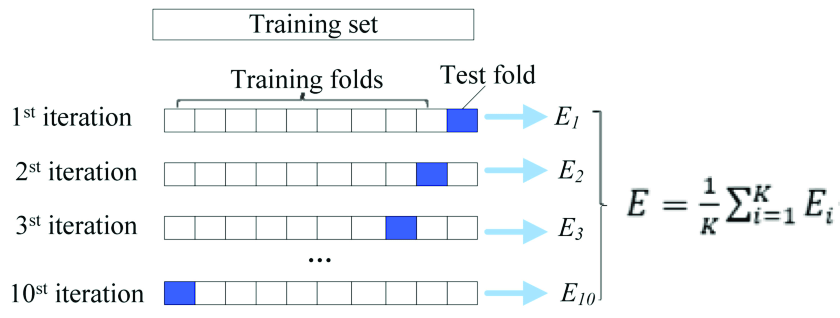

# Introduction

***Escherichia coli*** is a gram negative bacterium and it is the most studied bacterial model organism for many reasons like its ability to grow fast on cheap media and the fact that it can be genetically manipulated and modified much easier with respect to eukaryotic organisms like yeast or animals or even other bacteria. When an organism is as studied as *E. coli* the amount of data available about it can be massive, for this reason we would like to perform a bioinformatic analysis to extract knowledge from on one of the many RNA-seq dataset available for *E. coli*.

This project aims to establish a **proxy** for determining the activity of transcription factors based on the expression levels of the genes regulated by those factors. In prokaryotes genes with related functions are encoded together within the same genome block, which is called **operon**, and they are usually transcribed together in a, so called, **polycistronic transcript** because they are under the control of the same promoter.

The null hypothesis posits that the *abundance of transcripts serves as a reliable proxy for activity of the regulator*. However, this assumption may not hold for all transcription factors: some factors are active only when phosphorylated, meaning that their transcripts may be constitutively expressed while their activity depends on phosphorylation, correlating instead with the activity of the corresponding kinase.

We will also focus on developing a general model to relate transcription factor activity to transcript abundance. Significant deviations from this model could indicate transcription factors whose activity is not accurately reflected by transcript levels. One challenge of this approach is the fact that genes of the same operon may be highly *co-expressed* together which is a problem for many models like **linear regression**, so we will try to address it during our analysis.

### Table of Contents

Here are the steps that we performed in our analysis

1.  [Introduction]

2.  [Library loading]

3.  [Pre-processing]

4.  [Exploratory Analysis]

5.  [Modelling] -[cAMP Receptor Protein (crp)](#camp-receptor-protein-crp)

# Library loading

```{r message=FALSE, warning=FALSE}
library(readr)
library(matrixStats)
library(dplyr)
library(ggplot2)
library(grid)
library(gridExtra)
library(caret)
library(glmnet)
library(igraph)
library(vip)
library(ggrepel)
```

# Pre-processing

Let's start importing the dataset from [PreciseDB](https://www.ncbi.nlm.nih.gov/pmc/articles/PMC540045/) which is an RNA-seq compendium for *Escherichia coli* from the Systems Biology Research group at UC San Diego which contains the expression levels for 3,923 genes in E. coli for 278 different condition. The approach they used was culturing bacteria on many different media and they measured gene expression values then they proceeded to knock-out many different genes and cultured again on the same media to measure expression again because they were expecting variations of expression; for example, they knocked out a gene for iron metabolism on a medium containing iron and this for sure affects the expression levels of the *E.coli* culture because the organism is not able to manage iron correctly anymore.

```{r}
# Import file 
log_tpm <- read.csv("log_tpm_full.csv", row.names = 1)
log_tpm
```

Next we want to perform some pre-processing. First we want to exclude:

-   Condition with knock-out genes

-   Genes with isoforms

For the nature of our analysis we are not interested in the conditions in which a gene is knocked-out because the influence of the knock-out gene may be huge on its related pathways, for this reason we excluded them because we want unbiased results. Researchers of PreciseDB also collected expression data about many gene isoforms, the problem is that the collection of isoforms was not complete and there was not a reliable way to decide which isoform to consider: considering all of them during the preprocessing would have resulted in having unmappable bnumbers and duplicate genes so we removed them from the dataset before proceeding.

```{r}
# Exclude condition with knockout genes
log_tpm <- log_tpm[, -grep("_del", colnames(log_tpm))]

# Drop genes with isoform
genes_with_isoforms <- grep("_\\d+$", rownames(log_tpm), value = TRUE)

log_tpm <- subset(log_tpm, !(rownames(log_tpm) %in% genes_with_isoforms))
dim(log_tpm)
```

Now we can proceed to import the regulatory network from [RegulonDB](https://regulondb.ccg.unam.mx/) that reports the target genes for each regulator. Each row of this dataset represents an edge in a regulatory network graph and contains informations about the interaction of which one of the most important one is probably if the interaction is positive or negative.

```{r}
regulator <- read.table(file="tableDataReg.csv",
                        header=TRUE, 
                        sep=",")
regulator
```

We decided to eliminate:

-   Entries that are not referred to a protein regulator.

-   Relationships reported as *Weak* or *Unknown* to work only on meaningful interactions.

```{r}
regulator <- regulator[which(regulator[, 2] != "ppGpp"), ]

w <- which(trimws(regulator[,7])=="W")
if(length(w)>0){
  regulator <- regulator[-w,]
}

w <- which(trimws(regulator[,7])=="?")
if(length(w)>0){
  regulator <- regulator[-w,]
}

nrow(regulator)
```

There is a discrepancy between the gene identifiers present in the regulatory network obtained from RegulonDB and those in the PreciseDB dataset. While the regulatory network uses gene names, our dataset contained identifiers in the form of bnumbers. So it's better to convert bnumbers to gene names to facilitate comparison and downstream analysis. In addition we decided to:

-   Remove entries with bnumbers that don't map with a gene name

-   Remove duplicate genes

```{r}
# Loading the file from ECOcyc which contain the mapping bnum-genename
map_bnum <- read.delim("mapbnum.txt", header = TRUE)

# Keep only the useful columns
map_bnum <- map_bnum[c("Gene.Name", "Accession.1")]

# Map between our dataset and the file of ecocyc
log_tpm$gene_number <- rownames(log_tpm)
log_tpm <- merge(log_tpm, map_bnum, by.x = "gene_number", by.y = "Accession.1", all.x = TRUE)

# Rearrange the dataset
log_tpm <- log_tpm[, c("Gene.Name", setdiff(names(log_tpm), "Gene.Name"))]

# Removing unmapped genes bnumber
log_tpm <- subset(log_tpm, !is.na(Gene.Name))

# Removing duplicate genes (it also has all expression values equal 0 so very bad)
log_tpm <- subset(log_tpm, !(log_tpm$Gene.Name == "insI2"))

# Setting rownames and dropping the first 2 columns
rownames(log_tpm) <- log_tpm$Gene.Name
log_tpm <- log_tpm[,3:ncol(log_tpm)]

# Transpose log_tpm in order to have genes as columns and conditions as rows
log_tpm <- t(log_tpm)
```

# Exploratory Analysis

We would like to verify if we can use one the four major summary statistics which are **mean**, **median**, **maximum** and **minimum** of expression of each gene to model the *relationship between the targets and their regulator*. Now let's analyze the distribution of these statistics to understand which is the best value to choose, if any, then we also want check if they follow a **Gaussian distribution** using the Shapiro--Wilk test which computes the W statistics as follows:

$$
W = \dfrac{\big(\sum^n _ {i=1} a_i x_{(i)} \big ) ^2}{\sum^n _ {i=1} (x_i - \bar{x})^2}
$$

Then this W value is used for the hypothesis testing that follows:

$$
H_o: \text{a sample } x_1, \cdots, x_n \text{ is drawn from a normally distributed population.} \\
H_a: \text{a sample } x_1, \cdots, x_n \text{ is not drawn from a normally distributed population.}
$$

If the test returns a *p-value* lower then the threshold 0.05 it means that the data **do not** follow a normal distribution.

```{r}
# Histograms of Summary Statistics

# MEAN
log_tpm_mean <- data.frame(value = apply(log_tpm, 2, mean))
mean_hist <- ggplot(log_tpm_mean, aes(x = value)) +
                    geom_histogram(binwidth = 0.5, fill = "skyblue", 
                                   color = "black", bins = 100) +
                    labs(x = "Mean log-TPM", y = "Frequency") +
                    theme_minimal() +
                    theme(panel.grid.major = element_blank(), 
                          panel.grid.minor = element_blank())

# MEDIAN
log_tpm_median <- data.frame(value = apply(log_tpm, 2, median))
median_hist <- ggplot(log_tpm_median, aes(x = value)) +
                      geom_histogram(binwidth = 0.5, fill = "lightgreen", 
                                     color = "black", bins = 100) +
                      labs(x = "Median log-TPM", y = "Frequency") +
                      theme_minimal() +
                      theme(panel.grid.major = element_blank(), 
                            panel.grid.minor = element_blank())

# MAX
log_tpm_max <- data.frame(value = apply(log_tpm, 2, max))
max_hist <- ggplot(log_tpm_max, aes(x = value)) +
                   geom_histogram(binwidth = 0.5, fill = "lavender", 
                                  color = "black", bins = 100) +
                   labs(x = "Max log-TPM", y = "Frequency") +
                   theme_minimal() +
                   theme(panel.grid.major = element_blank(), 
                         panel.grid.minor = element_blank())

# MIN
log_tpm_min <- data.frame(value = apply(log_tpm, 2, min))
min_hist <- ggplot(log_tpm_min, aes(x = value)) +
                   geom_histogram(binwidth = 0.5, fill = "lightpink", 
                                  color = "black", bins = 100) +
                   labs(x = "Min log-TPM", y = "Frequency") +
                   theme_minimal() +
                   theme(panel.grid.major = element_blank(), 
                         panel.grid.minor = element_blank())

# Final Plot
grid.arrange(mean_hist, median_hist, max_hist, min_hist, nrow = 2, ncol = 2,
             top = textGrob("Histograms of Summary Statistics", 
                            gp=gpar(fontsize=16)))
```

```{r}
#MEAN
shapiro.test(log_tpm_mean$value) #not gaussian

#MEDIAN
shapiro.test(log_tpm_median$value) #not gaussian

#MAXIMUM
shapiro.test(log_tpm_max$value) #not gaussian

#MINIMUM
shapiro.test(log_tpm_min$value) #not gaussian
```

Based on the results of the Shapiro-Wilk tests conducted on the four distributions and their respective histograms, we can conclude that the distributions do not follow to a Gaussian (normal) distribution.\
Consequently, this implies that choosing measures such as the mean, median, maximum, or minimum may not match the linear regression assumption that the data follows a Gaussian (normal) distribution, for this reason it is not possible to use one of these statistics as a predictor in our model because none of them is normally distributed but the biggest problem is that we would train a model on a single sample and it does not make any sense. In the next section about modelling we will try instead to take the mean of all the targets in every condition and fit a model with 1 feature (mean of the targets) and as many samples as the conditions that we have.

Now we plot some histograms to have a better idea on the number of positive, negative and total interactions of each regulator and again we perform a Shapiro--Wilk test for each one of them to check for normality.

```{r}
# Divide positive and negative regulation
positive_reg <- regulator[regulator$X6.function == "+",]
negative_reg <- regulator[regulator$X6.function == "-",]

# Identify the different regulators in the dataset
unique_regulators <- unique(regulator$X3.RegulatorGeneName)

pos_counts <- c()
neg_counts <- c()

# Count how many genes are regulated by each regulator
for(reg in unique_regulators){
  pos_counts <- c(pos_counts, 
                  count(positive_reg[positive_reg$X3.RegulatorGeneName == reg,]))
  neg_counts <- c(neg_counts, 
                  count(negative_reg[negative_reg$X3.RegulatorGeneName == reg,]))
}

pos_counts <- unlist(pos_counts)
names(pos_counts) <- unique_regulators

neg_counts <- unlist(neg_counts)
names(neg_counts) <- unique_regulators

pos_counts <- data.frame(value = pos_counts)
neg_counts <- data.frame(value = neg_counts)
total_counts <- data.frame(value = pos_counts$value + neg_counts$value)

# Histograms of how many genes are regulated by each gene

# Positive Counts Histogram
pos_counts_hist <- ggplot(pos_counts, aes(x = value)) +
                          geom_histogram(binwidth = 10, fill = "skyblue", 
                                         color = "black", bins = 20) +
                          labs(x = "Positive Regulations Count", y = "Frequency") +
                          theme_minimal() +
                          theme(panel.grid.major = element_blank(), 
                                panel.grid.minor = element_blank())

# Negative Counts Histogram
neg_counts_hist <- ggplot(neg_counts, aes(x = value)) +
                          geom_histogram(binwidth = 10, fill = "lightgreen", 
                                         color = "black", bins = 20) +
                          labs(x = "Negative Regulations Count", y = "Frequency") +
                          theme_minimal() +
                          theme(panel.grid.major = element_blank(), 
                                panel.grid.minor = element_blank())

# Total Counts Histogram
total_counts_hist <- ggplot(total_counts, aes(x = value)) +
                            geom_histogram(binwidth = 10, fill = "lightpink", 
                                           color = "black", bins = 20) +
                            labs(x = "Total Regulations Count", y = "Frequency") +
                            theme_minimal() +
                            theme(panel.grid.major = element_blank(), 
                                  panel.grid.minor = element_blank())

# Final Plot
grid.arrange(pos_counts_hist, neg_counts_hist, total_counts_hist, ncol = 1)
```

```{r}
# Positive Interactions Counts normality test
shapiro.test(pos_counts$value) #not gaussian

# Negative Interactions Counts normality test
shapiro.test(neg_counts$value) #not gaussian

# Total Interactions Counts normality test
shapiro.test(total_counts$value) #not gaussian
```

These histograms show how many genes are regulated by how many regulators, the horizontal axis indicates how many genes are controlled by the regulator and the vertical axis indicates how many regulators have that number of interactions; for example there are more than 150 regulators that positively interact with 0 genes, this is not surprising because we removed weak and unknown interactions and we can also see that there is a gene that negatively controls a number of genes close to 400. There are slightly more negative regulators that interact with at least one gene then positive. In addition we observe that majority of genes does not interact with other genes but there are some exceptions like the gene **crp** which positively interacts with 310 other genes. We can also note that none of these is normally distributed.

### Network analysis

```{r}
# Creating adj matrix to plot the network
edge_list <- cbind(RegulatorName = regulator$X3.RegulatorGeneName, 
                   Target = regulator$X5.regulatedName)
graph <- graph_from_edgelist(edge_list)
layout <- layout_with_fr(graph, niter=100)


# Visualizzazione 3D della network
plot.igraph(graph, layout=layout, vertex.label=NA, vertex.size=3, edge.arrow.size=0.2, edge.curved=TRUE, main="E.coli Network", xlim=c(-0.5, 0.5), ylim=c(-1, 1))

```

# Modelling

In order to find a mathematical model able to describe the complexity of this biological problem we would like to start with simpler cases and look for what might be the best approach for them then we will apply this approach to each regulator. For this reason we will individually perform the modelling on the positive interactions of 2 genes to see which model can be suitable to be applied to all the genes; We chose the genes **crp** and **gene da scegliere**

## cAMP Receptor Protein (crp) {#camp-receptor-protein-crp}

The protein CRP is a **global transcription regulator**, which plays a major role in carbon catabolite repression (CCR) as well as other processes because it can act as an activator, repressor, coactivator or corepressor. CRP binds cyclic AMP (cAMP) which allosterically activates it, this means that its activity should not be influenced by the activity of any kinase, then it binds to its DNA binding site to directly regulate the transcription of about 300 genes in about 200 operons and indirectly regulate the expression of about half the genome.

### Simple Linear Regression

The first thing we want to try, as anticipated in the previous section, is taking the mean of all the targets in every condition and fit a linear regression model with only this one feature. Let's start to take the data about crp expression and the expression of its targets

```{r}
# Expression of crp
crp_exp <- log_tpm[,colnames(log_tpm) == "crp"]

# List of positively regulated targets by crp
crp_target <- positive_reg[positive_reg$X3.RegulatorGeneName == "crp",]

# Expression of the targets
crp_target_exp <- log_tpm[,colnames(log_tpm) %in% crp_target$X5.regulatedName]
```

Now we take the simple mean of all the genes of each condition, in this way we will obtain as many means as the number of samples (188) and we fit a linear regression model using this mean as the sole feature. Then we put together a dataframe with all the data needed.

```{r}
# Apply the mean to each row of the dataset (mean of each condition)
crp_target_mean_conditions <- apply(crp_target_exp, 1, mean)

# Creating the training dataframe
crp_mean_train <- data.frame(crp = unlist(crp_exp), 
                             targets = unlist(crp_target_mean_conditions))
```

All the models that we will fit in this project will be validated with **10-fold cross-validation**, cross-validation is a simple and widely used sampling technique for estimating prediction error to assess how the model would act against unseen data. It is often done when there is not enough data to set aside a validation set and it has many advantages like preventing overfitting by providing a more robust estimate of the model's performances and allowing model selection and hyperparameter tuning while being at the same time data efficient because all the data is used for training and testing the model. In the case of linear regression the purpose of cross-validation is only to get a robust estimate of the performances but in the next sections we will try to use it for model selection and hyperparameter tuning. The rationale of 10-fold cross-validation is very simple because it divides the dataset in 10 folds then it uses 9 for training and the last one for testing, this procedure is repeated other 9 times by changing the testing fold and by using the remaining ones for training.



As you can see from the picture above at every iteration the procedure computes an error metric and at the end it will take the average of all the metrics to gave us a more robust estimate of real testing error. The **caret package** is the R equivalent of Python scikit-learn and it allows to very easily set up the training of Machine Learning models and it also provide a very nice way to set-up a cross-validation in order to have more reliable models!

```{r}
## 10-fold CV
fit_control <- trainControl(
  method = "repeatedcv",
  number = 10,
  ## repeated ten times
  repeats = 10)
```

Let's get back to linear regression, using one feature we are in a setting for the use of **simple linear regression** which is a model that assumes that there is a linear relationship between $X$ and $Y$, in this case $Y$ is the expression of our regulator crp and $X$ is the mean of all its targets. The relationship between $X$ and $Y$ is modelled as follows:

$$Y \approx \beta_0 + \beta_1 X$$

To find a solution for this problem the **Least Squares Method** is employed: we know that $\hat{y_i} = \hat{\beta_0} + \hat{\beta_1}x_i$ is a prediction from our model and $e_i = y_i - \hat{y_i}$ is the residual error, that is the difference between the actual value $y_i$ and the predicted one $\hat{y_i}$.\
Least squares finds a solution that minimizes the residual sum of squares of all training data, RSS.

$$
RSS = e_1^2 + e_2^2 + \dots + e_N^2 = \sum_i (y_i - \hat{y_i})^2 = \sum_{i=1}^N (y_i - \hat{\beta_0} - \hat{\beta_1}x_i)^2
$$

Now we compute the partial derivatives of RSS with respect to the model parameters $\hat{\beta_0}$ and $\hat{\beta_1}$ and equate them to 0. The RSS function is **globally convex**, meaning that there exist a single stationary point which is a minimum for this reason we don't need to compute the second derivative to find the global minumun and we can directly solve the equations obtained before with respect to the parameters in this way:

$$\hat{\beta}_{1}=\frac{\sum_{i=1}^{n}\left(x_{i}-\overline{x}\right)\left(y_{i}-\overline{y}\right)}{\sum_{i=1}^{n}\left(x_{i}-\overline{x}\right)^{2}} \quad\quad$$ $$\hat{\beta}_{0}=\overline{y}-\hat{\beta}_{1} \overline{x}$$

where $\bar{x}$ is the mean of the means of expression of crp targets in all the conditions and $\bar{y}$ is the mean expression of crp.

As anticipated before the fitting of linear regression with 10-fold cross-validation with caret can be achieved in a very simple way and with few lines of code

```{r}
#cv is a random procedure so we set a random seed for reproducibility
set.seed(123)

crp_lm_mean <- train(crp ~ targets, 
                     data = crp_mean_train,
                     method = "lm",
                     trControl = fit_control)
crp_lm_mean
```

The coefficient of determination, or $R^2$, is a measure that provides information about the goodness of fit of a model. In other word it is a value that tells us about the variance of the data explained by the model, it is computed using the following formula.

$$
R^2 = \dfrac{\sum^{n} _ {i = 1} \big(\hat{y_i} -\bar{y} \big)^2}{\sum^n _ {i = 1} (y_i -\bar{y})^2}
$$

$R^2$ values close to 1 tell us that the model is able to explain almost 100% of the variance of the data indicating that the model fitted very well the data and values close to 0 tell the opposite, in this case we got an $R^2$ = 0.03536782 which is a very low value and this means that the regression was not able to model the expression of the gene crp using the mean of its target. This result can be further explained by looking if some assumption of linear regression was not matched, more in detail we will now look for homoschedasticity and normality of the residuals.

```{r}
# scatterplot of the data with the regression line
crp_lm_mean_scatterplot <- ggplot(crp_mean_train, aes(x = targets, y = crp)) +
                           ggtitle("Scatterplot of targets mean and crp") +
                           theme(plot.title = element_text(hjust = 0.5)) + 
                           xlab("Targets Mean in each Condition") + 
                           ylab("crp expression in log(TPM)") + 
                           geom_point(size = 2) + 
                           geom_abline(intercept = crp_lm_mean$finalModel$coefficients[[1]],
                                       slope = crp_lm_mean$finalModel$coefficients[[2]],
                                       color = "red",
                                       linewidth = 1)  

# Dataframe containing fitted values and the residuals
crp_res <- data.frame(fitted.values = crp_lm_mean$finalModel$fitted.values,
                      residuals = crp_lm_mean$finalModel$residuals)

# Residuals scatterplot
crp_lm_mean_residuals <-  ggplot(crp_res, aes(x = fitted.values, y = residuals)) +
                          ggtitle("Residuals plot") +
                          theme(plot.title = element_text(hjust = 0.5)) + 
                          xlab("Fitted Values") +
                          ylab("Residuals") + 
                          geom_point() +
                          geom_hline(yintercept = 0, color = "red")

# Final plot
grid.arrange(crp_lm_mean_scatterplot, crp_lm_mean_residuals, nrow = 1)
```

On the left you can see the scatterplot of the targets mean in each condition as the independent variable and the value of expression of crp in $log(TPM)$ as the dependent variable with the regression line predicted by the model above drawn; on the right you can see the scatterplots of the residuals and we can notice just by looking that one assumption of linear regression is not matched: the variance of the residuals is not constant which means that the **homeschedasticity of the residuals** assumption is not met. Now let's look for the normality of the residuals.

```{r}
crp_lm_mean_qq <- ggplot(crp_res, aes(sample=residuals)) +
                  ggtitle("Residuals QQ-plot") +
                  theme(plot.title = element_text(hjust = 0.5)) +
                  xlab("Theoretical Quantile") +
                  ylab("Residuals Quantiles") + 
                  stat_qq() + 
                  stat_qq_line(color = "red")
crp_lm_mean_qq
```

```{r}
shapiro.test(crp_res$residuals)
```

By looking at the QQ-plot we can see that the points are on the line for the most part but they are skewed at the tails and considering a p-value threshold of 0.05 for the normality test we can confidently say that the residuals are **not normally distributed**: another important assumption of linear regression is not matched. Considering all the elements discussed before we conclude that this simplicistic model is not able to describe the complex relationship between a regulator and its targets.

### Multivariate Linear Regression

Since only one variable was not enough to explain the relationship between the regulator and its targets we will now try to extend linear regression in order to include more variables in the model. Similarly to simple linear regression, we want to find the values for the model's parameters that minimize the residual sum of squares. The mathematical formulation of a multivariate linear regression is the following:

$$\hat{y}=\hat{\beta}_{0}+\hat{\beta}_{1} x_{1}+\hat{\beta}_{2} x_{2}+\cdots+\hat{\beta}_{p} x_{p}$$

The least squares solution for this problem involves matrix multiplication and the use of the, so called, **pseudo-inverse** to compute the ${\hat\beta}$ coefficients then it uses them to compute the model's predictions $\hat{y}$ by multiplying the vector of coefficients $\hat{\beta}$ with the matrix of the predictors $X$.

$\hat{\beta}=\left(\mathbf{X}^{T} \mathbf{X}\right)^{-1} \mathbf{X}^{T} \mathbf{y} \quad\quad$ with $X$ a $N \times (p+1)$ matrix, $y$ a $N \times 1$ vector

$\hat{\mathbf{y}}=\mathbf{X} \hat{\beta}=\mathbf{X}\left(\mathbf{X}^{T} \mathbf{X}\right)^{-1} \mathbf{X}^{T} \mathbf{y} \quad\quad$ with $\hat{y}$ the predicted value for each sample

The first step is creating a dataframe containing the expression of crp and of all its targets.

```{r}
crp_exp <- data.frame(crp = crp_exp)
crp_full <- data.frame(cbind(crp_exp, crp_target_exp))
```

Then we train a model using all the target genes as predictors for crp expression with no further pre-processing and we cross-validate it.

```{r, warning = FALSE}
set.seed(123)
crp_lm <- train(crp ~., 
                data = crp_full,
                method = "lm",
                trControl = fit_control)
crp_lm
```

As you can see the $R^2$ of this model is still not satisfying at all and the RMSE is also very high: the Root Mean Square Error (RMSE) is a metric that describes the average distance between the predicted values and the real values

$$
RMSE = \sqrt{\dfrac{\sum^{n} _ {i = 1} \big(\hat{y_i} -\bar{y} \big)^2}{n - p}}
$$

which means that a value of RMSE = 9.858278 is very high in the context of gene expression because we are working in logarithmic scale. The reason why this model is so bad is directly told us by caret with a warning message (here suppressed) which says that the model was not able to obtain a lot of $\beta$ coefficients because our predictor variables are correlated and an important assumption of linear regression is the **independence of the predictor variables**. This strong correlation between our variables is expected because they are all genes controlled by our regulator crp so it makes very much sense that they are correlated and it is also one of the reasons of this analysis. In order to remove this multi-collinearity we will try 2 main approaches: **feature selection** and **dimensionality reduction.**

### Lasso Regression

The first approach we want to try is the Lasso Regression that is essentially multivariate linear regression but with the introduction of a **penalization term** which regularizes the estimates of the coefficients. This method is part of the family of the **shrinkage methods** and its main advantage is that it can force some of the coefficients of the model to be equal to 0 which means that it is also an effective way to perform feature selection. For this purpose Lasso minimizes the following function:

$$
\sum^n _{i=1} (y_i - \beta_0 - \sum^p _{j = 1}\beta_jx_ij)^2 + \lambda\sum^p_{j = 1}|\beta_j|
$$

Here p is the number of predictors (number of targets of crp) and $\lambda$ is a tunable hyperparameter which tells us how much we can "spend" in terms of coefficients, the right value of $\lambda$ forces some coefficients to 0 and perform feature selection. The best value for $\lambda$ has to be found with cross-validation for hyperparameter selection, it is interesting to note that if $\lambda$ = 0 this minimization is simply the least squares method. Another important thing to do is to scale our data because Lasso is a method sensible to the scale, luckily caret can do this very easily using the preProcess argument in the train function.

```{r, warning = FALSE}
set.seed(123)
# Tuning grid for Lasso 
tune_grid_lasso <- expand.grid(alpha = 1, #tell the function to perform lasso
                               lambda = 10^(-5:5)) #values of lambda to try

# Lasso training, cv and hyperparameter tuning
crp_lasso <- train(crp ~., 
                   data = crp_full,
                   method = "glmnet",
                   preProcess = c("center", "scale"), #this basically transform in Z scores
                   trControl = fit_control,
                   tuneGrid = tune_grid_lasso)
crp_lasso
```

For the tuning of $\lambda$ we tried powers of 10 from $10^{-5}$ to $10^5$ and as you can see for values greater than $10^{-1}$ the model was not able to correctly converge (caret gave a warning we suppressed) for the same reasons of linear regression discussed before but for smaller values of $\lambda$ they were able to converge and obtain good $R^2$.

```{r}
cv_lasso_plot <-  ggplot(data = crp_lasso$results, aes(x = log10(lambda), y = RMSE, group=1)) +
                  ggtitle("Lasso Cross-Validation Results") +
                  theme(plot.title = element_text(hjust = 0.5)) +
                  xlab("log(λ)") + 
                  ylab("RMSE (Repeated Cross-Validation)") + 
                  geom_line(color="blue")+
                  geom_point()

cv_lasso_plot
```

Finally with 10-fold cross-validation, as you can see from the plot above, we chose $\lambda = 10^{-3}$ as the final hyperparameter and the RMSE of this model is also very acceptable if we think in logarithmic scale in the context of gene expression. Let's now take a look to the coefficients of the model

```{r}
plot(crp_lasso$finalModel, xvar = "lambda", xlab= "log(λ)")
```

In this messy plot each line represents how the estimated coefficient $\hat\beta$ of a gene changes with respect to the value of $\lambda$, as you can see the majority of these lines go to 0 before $log(\lambda) = -3$ so these genes have their coefficient set to 0 while the remaining genes have a coefficient different from 0.\
Another interesting way of visualizing the coefficients and their importance is through the use of the **vip package**. This package gives nice plots by ranking the variables with a model specific importance metric, in the case of Lasso it returns the absolute values of the coefficients and ranks them in descending order.

```{r, fig.width = 9, fig.height = 16}
vip(crp_lasso$finalModel, method = "model", num_features = 125)
```

It is very interesting to note that the first 121 gene coefficients are different from 0 and the remaining 189 gene coefficients are set to 0 by the Lasso procedure (here only 4 shown for simplicity). Let's now look at some of the most important genes and their biological function to see if their importance makes sense:

1)  **sucD**: succinyl-CoA synthetase is a very important enzime in the citric acid cycle, one the most fundamental processes of every living organism thus it enables the survival of the cell. sucD specifically is part of the $\alpha$ subunit which binds CoA and phosphate while the $\beta$ subunit binds the succinate in order to catalize the synthesis of succinyl-CoA.  From a biological point of view it makes sense that this gene is very important because it is part of a basic biochemical process and in the image above you can see that crp activated by cAMP is in the regulatory network of RNAP which transcribes the operon that contains sucD.
2)  **rpsF**: 30S ribosomal subunit protein S6, as the name says, is a subunit of the ribosome which is the macromolecular complex, composed by rRNA and proteins, involved in the translation of mRNA to protein.  Again this is a very basic biological process and also involve protein synthesis and we should remember that CRP itself is a protein so it makes much sense that the expression of this gene is able to explain the expression of crp.
3)  **gatY**: tagatose-1,6-bisphosphate aldolase 2 is important in the process of galactitol degradation, a toxic alcohol which is a subproduct of galactose metabolism. Since galactose is a sugar used in many of the media on which the cultures of *Escherichia coli* are grown it makes sense that a gene involved in the degradation of a toxic compound related to galactose is important for crp, a global transcription factor, because it ensures the global survival of the cell in its environment. {width="600"}

Now we know that Lasso may be a reliable method for the modelling of our targets-regulator relationship but it is heavily dependent on the value of $\lambda$ chosen which might be different for other regulators, when we will analize all the genes we will try to verify this possibility.

### Principal Component Regression
